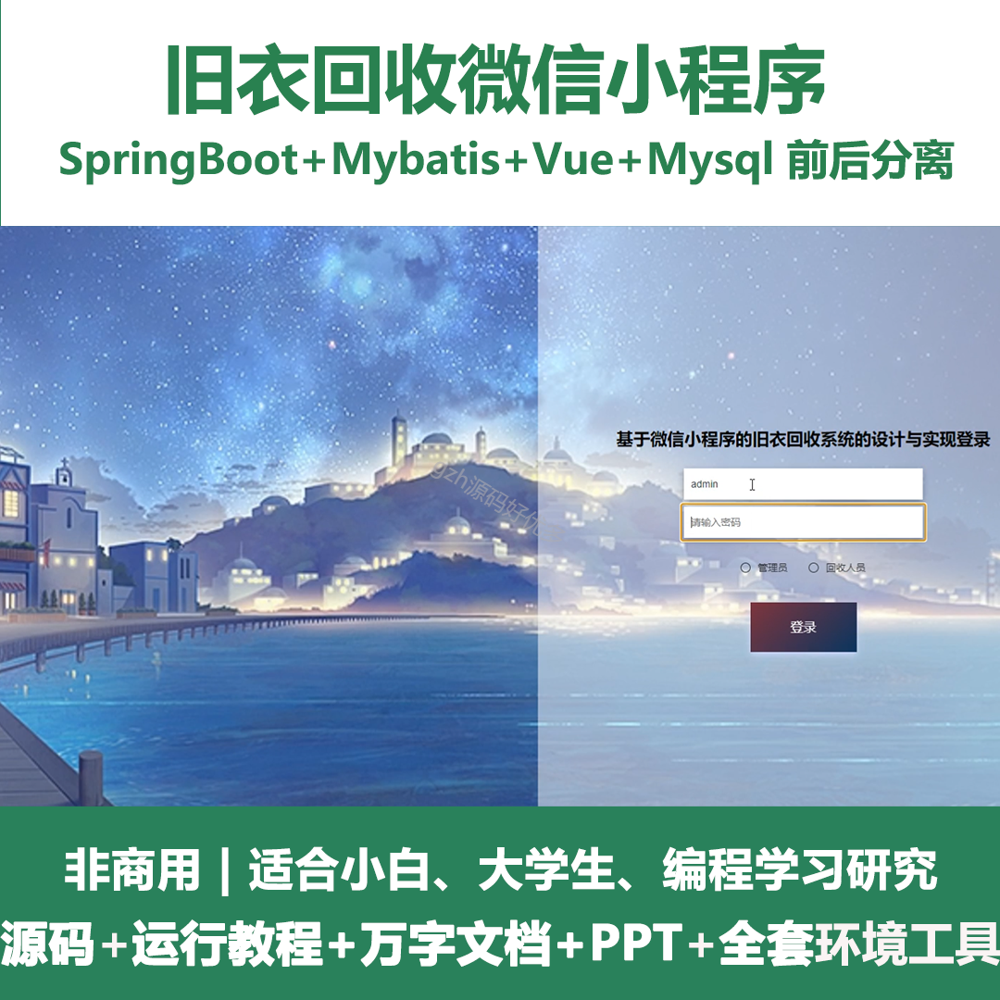
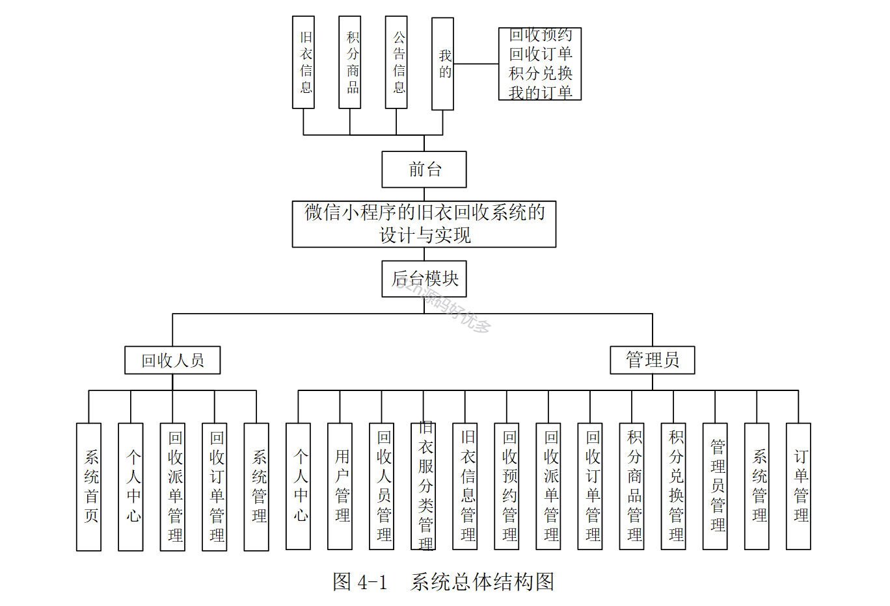
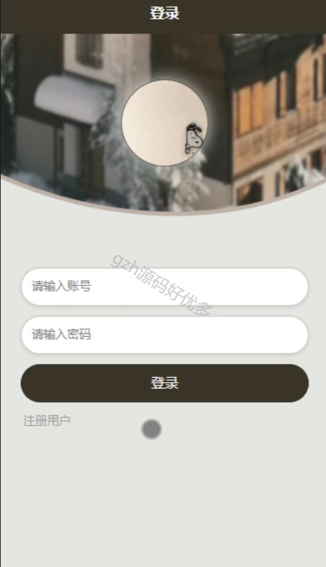
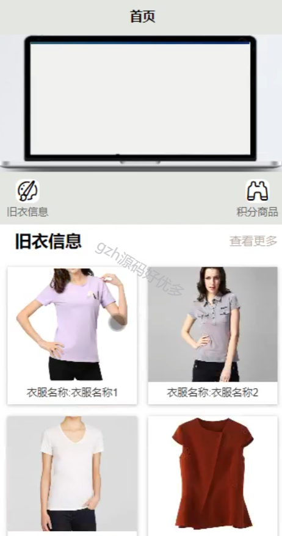
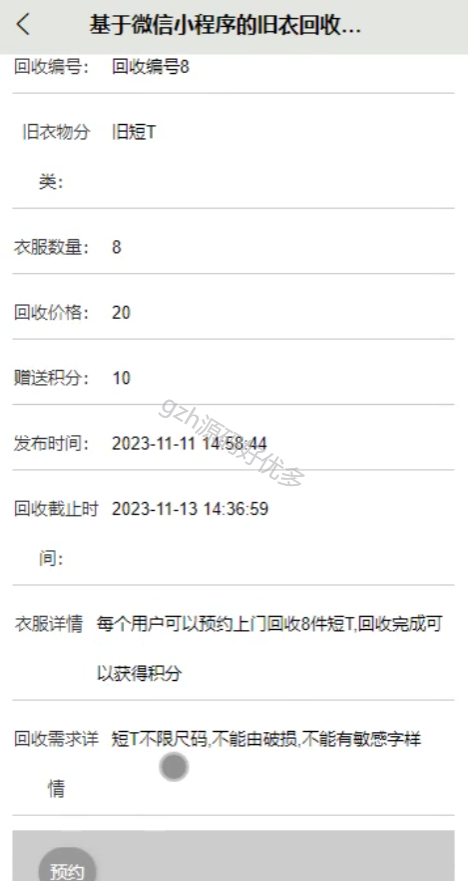
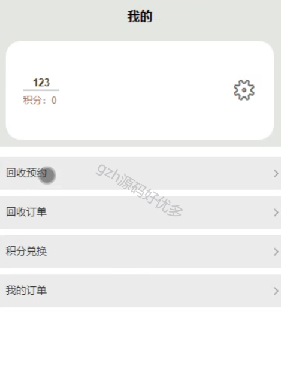
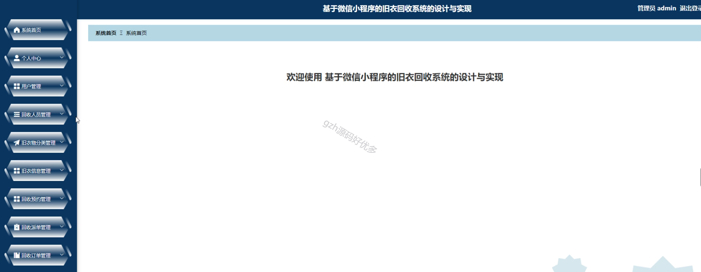
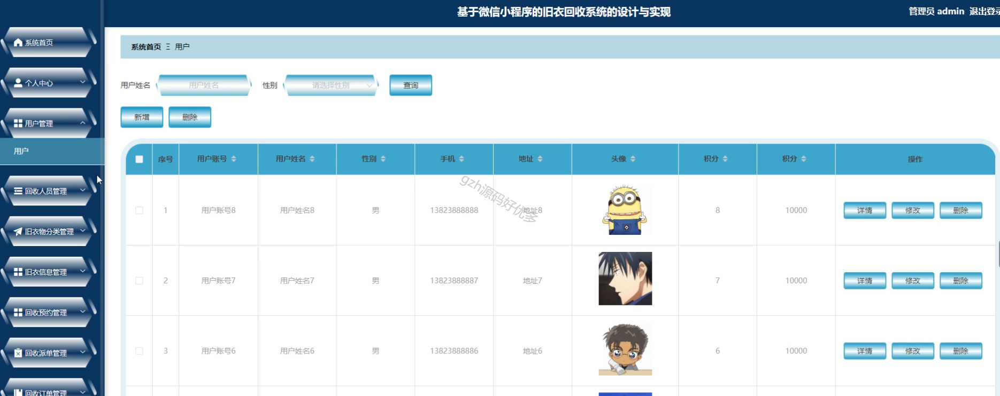
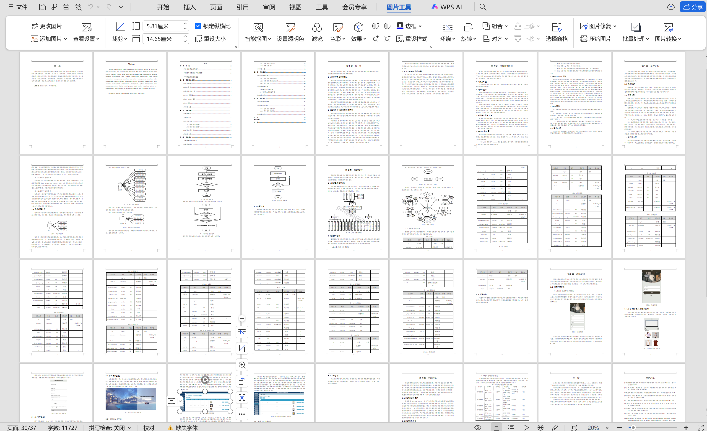

# mpweixinA067
mpweixinA067旧衣回收微信小程序LW+PPT
 
## 查看主页获取源码

### 一、作品包含

源码+数据库+设计文档万字+PPT+全套环境和工具资源+部署教程

### 二、项目技术

前端技术：Html、Css、Js、Vue2.0、Element-ui、Uniapp

数据库：MySQL

后端技术：Java、Spring Boot、MyBatis

  

### 三、运行环境

开发工具：IDEA/eclipse + HBuilderX + 微信开发者工具

数据库：MySQL5.7（最低要5.7版本）

数据库管理工具：Navicat10以上版本

环境配置软件： JDK1.8+Maven3.6.3

前端Nodejs：14

### 四、项目介绍
项目编号：mpweixinA067

基于微信小程序的旧衣回收系统是一种专为环保生活设计的应用软件。这款小程序的主要功能包括：系统首页、个人中心、用户管理、回收人员管理、旧衣服分类管理、旧衣信息管理、回收预约管理、回收派单管理、回收订单管理、积分商品管理、积分兑换管理、管理员管理、系统管理、订单管理等。微信小程序的旧衣回收系统是一款全面、实用的软件，能够为客户提供全方位的服务。

### 五、运行截图

  
